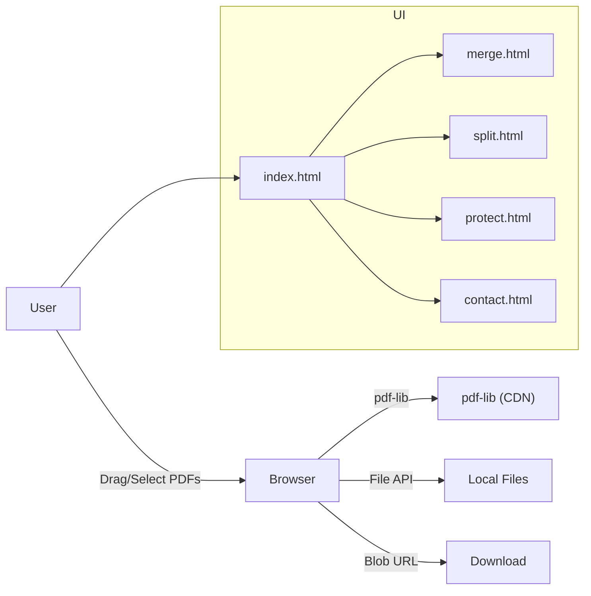
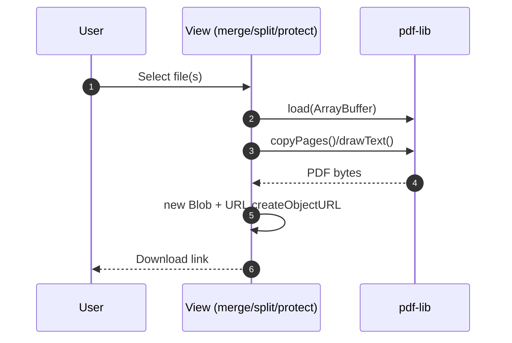
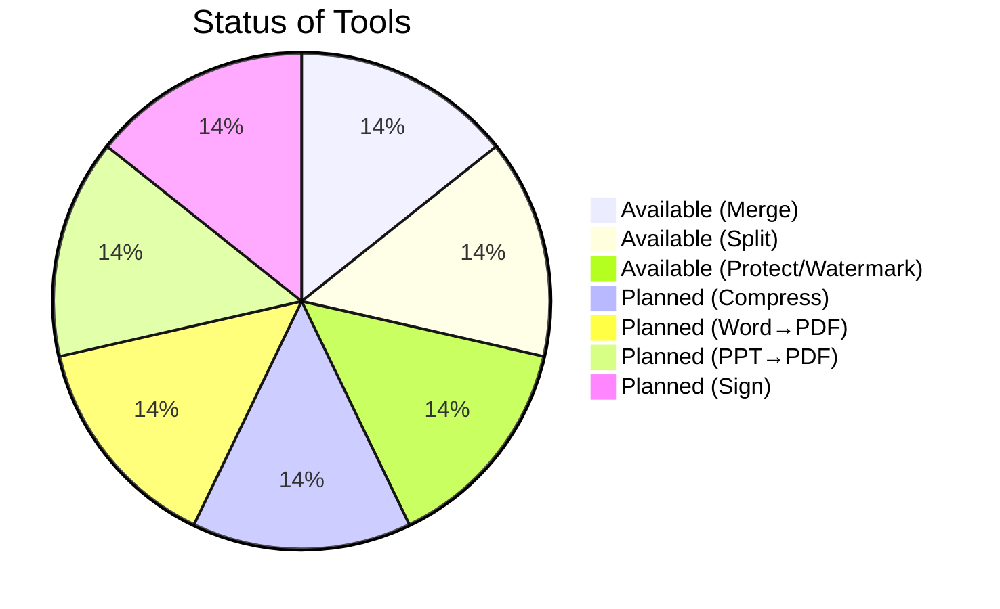

  

  <h1>SwiftPDF — Fast, Private, In‑Browser PDF Tools</h1>
  

    Merge, split, preview, and lightly protect PDFs — instantly, in your browser. 
    No installs. No accounts. Your files never leave your device.
  

  

    <a href="index.html"><b>Open App (local)</b></a> ·
    <a href="https://www.thevb24.com"><b>Website</b></a>
  

  Built with HTML, CSS, JavaScript, Bootstrap, pdf-lib, and Typed.js

---

## Overview

SwiftPDF is a lightweight, privacy‑first web app for everyday PDF tasks. All processing happens on the client side using modern browser APIs and the pdf-lib library. This keeps things fast, private, and portable — you can host it anywhere that serves static files, or even run it offline once assets are cached.

### What You Can Do Right Now
- Merge multiple PDFs into one (`merge.html`).
- Split a PDF into individual pages with live previews and per‑page downloads (`split.html`).
- Merge selected pages (e.g., 1,3,5) from a PDF into a new PDF (`split.html`).
- Apply a visual watermark as a “protect” step across all pages (`protect.html`).
- Use a responsive, polished UI with Bootstrap and custom styles (`style.css`).
- Reach out via a Web3Forms‑powered contact form (`contact.html`).

### Coming Soon (Already scaffolded)
- Compress PDF
- Word to PDF
- PowerPoint to PDF
- Sign PDF (formal signing and PKI)

See the placeholders and holding pages: `maintainance.html` and `tool.html`.

---

## Objectives
- Zero‑setup PDF utilities that run fully in the browser.
- Privacy by design: keep documents local to the user’s machine.
- Simple, fast, and accessible UX suitable for everyone.
- Portable deployment: static hosting, CDN, or local file system.
- Clear roadmap for more advanced document workflows.

---

## Architecture

All features are implemented as static pages with client‑side JavaScript. PDFs are handled in memory using pdf‑lib and delivered back to the user with Blob URLs.

Key points:
- 100% client‑side — no server needed for current tools.
- `pdf-lib` provides page copying, merging, and drawing (for watermarks).
- Downloads are created via `Blob` + `URL.createObjectURL` for instant saves.
- Previews use the `<object>` tag and a full‑screen Bootstrap modal.

---

## Tech Stack
- HTML5, CSS3, JavaScript (vanilla)
- Bootstrap 5 (layout, responsive components)
- pdf-lib (client‑side PDF manipulation)
- Typed.js (animated headlines)
- jQuery (small DOM conveniences in some views)
- Google Fonts (Iceland, Montserrat Alternates, Caveat, Indie Flower, Alegreya)
- Web3Forms (contact form backend as a service)

CDN usage keeps the app lightweight and easy to host. For offline operation, you can vendor these assets locally.

---

## File Map
- `index.html` — Landing page, tool cards, hero animation (Typed.js), footer.
- `merge.html` — Multi‑file merge with `pdf-lib`. Counts selected files and produces a single `merged.pdf`.
- `split.html` — Split into per‑page PDFs with live previews, delayed downloads, and “merge selected pages” tool.
- `protect.html` — Visual watermark across all pages using `pdf-lib.drawText` (note: this is not PDF encryption).
- `maintainance.html` — Holding page for in‑progress tools.
- `tool.html` — Temporary “coming soon” notice.
- `contact.html` — Web3Forms contact form with background map and translucent panel.
- `price.html` — Simple three‑tier pricing UI (Basic / Standard / Premium).
- `style.css` — Global styles for card grid, ribbons, testimonial headings, responsive tweaks.
- Images/SVGs — Branding and UI illustrations (e.g., `logo.png`, `merge.jpg`, `split.jpg`, `Sprinkle1.svg`).

---

## How It Works (Under the Hood)

### Merge PDFs (`merge.html`)
- Uses `PDFDocument.create()` to build a new document.
- For each uploaded file: `PDFDocument.load()` + `copyPages()` to append pages.
- Saves as bytes, creates a `Blob`, then exposes a download link.

### Split + Selective Merge (`split.html`)
- Loads a single PDF and iterates `getPageCount()`.
- For each page: creates a new `PDFDocument`, copies the page, and renders a preview using an `<object>`.
- Adds a small 5‑second “preparing” delay before download for UX feedback.
- Accepts comma‑separated page numbers to create a selective merge into a new PDF.

### Protect (Watermark) (`protect.html`)
- Loads the PDF and draws a diagonal text watermark with opacity on each page using `drawText()`.
- Note: This is a visual protection technique — not cryptographic password protection.

---

## Getting Started

Quickest way:
1) Double‑click `index.html` to open in your browser.
2) Internet connection is required the first time (CDN assets: Bootstrap, pdf‑lib, Typed.js).
3) Use the tool cards to open Merge, Split, or Protect pages.

Developer‑friendly way (recommended):
- Serve the folder with a static server to avoid any browser URL quirks:
  - Node: `npx serve .` or `npx http-server .`
  - Python: `python -m http.server 8000`
  - VS Code: Live Server extension
  - Any static host: GitHub Pages, Netlify, Vercel

---

## Usage Guide

### Merge
- Open `merge.html`.
- Click “Choose Files” and select two or more PDFs.
- Click “Merge PDFs” and then “Download Merged PDF”.

### Split
- Open `split.html`.
- Choose a single PDF, click “Split PDF”.
- Preview each page card. Click “Download Page X” to save that page.
- To merge specific pages: enter numbers like `1,3,5` and click “Merge Selected Pages”.

### Protect (Watermark)
- Open `protect.html`.
- Choose a PDF and enter a password string (used as watermark text).
- Click “Protect PDF” and download the watermarked file.
- Note: This does not lock the file with a password; it applies a visible watermark only.

---

## Why SwiftPDF Stands Out
- Client‑side privacy: files never leave your device.
- Zero setup: open and go; works anywhere static files can be served.
- Fast feedback: instant previews and downloads.
- Clean UX: polished cards, responsive layout, and smooth animations.
- Extensible architecture: easy to add tools as separate pages.

---

## Security, Privacy, and Limits
- All current operations run in the browser; no server uploads.
- Watermark “protect” is not encryption; advanced password protection requires a different approach (see Roadmap).
- Very large PDFs depend on browser memory limits.
- CDN availability is required unless you vendor libraries locally.

---

## Roadmap / Future Scope
- True PDF password protection and permissions (owner/user passwords, AES‑128/256).
- Lossy and lossless compression levels with quality presets.
- Reorder pages with drag‑and‑drop; rotate and delete pages inline.
- Combine tools into a single “workspace” with thumbnails.
- Drawn and certificate‑based signatures (PKI).
- PDF to image (PNG/JPEG) and image to PDF.
- Office conversions (DOCX/PPTX to PDF) via a safe API or on‑prem converter.
- PWA: offline support and installable app shell.
- i18n and accessibility improvements.

---

## Contributing
Contributions are welcome! Here’s how to help:
- Open issues for bugs, ideas, and UI/UX suggestions.
- Fork and create a feature branch from `main`.
- Keep pages self‑contained (one tool per page) and re‑use styles in `style.css`.
- Prefer CDN for quick demos; add a note if a tool needs local bundling.
- Submit a focused PR describing the change and screenshots for UI work.

Suggested starter tasks:
- Implement Compress (client‑side first pass).
- Add drag‑and‑drop for file inputs.
- Add a page reordering UI for merges.
- Vendor CDN assets behind a build flag for offline use.

---

## Deployment
- Static hosting works out of the box (no server code needed).
- Recommended: GitHub Pages, Netlify, Vercel, Cloudflare Pages, or any S3/CDN.
- Set a custom domain and enable HTTPS.

---

## Acknowledgements
- [pdf-lib](https://pdf-lib.js.org/) — stellar client‑side PDF toolkit.
- [Bootstrap](https://getbootstrap.com/) — responsive UI framework.
- [Typed.js](https://mattboldt.com/demos/typed-js/) — typewriter effect.
- [Web3Forms](https://web3forms.com/) — backend‑as‑a‑service for the contact form.

---

## Notes
- License: No explicit license file present. If you plan to open‑source, add a `LICENSE` file (e.g., MIT). Otherwise, keep it proprietary.
- SEO: `index.html` includes `canonical` and meta tags; expand these as needed.
- Branding: Images and SVGs are local; optimize for web where possible.

---

## Conclusion
SwiftPDF delivers a fast, private, and elegant experience for common PDF tasks — all in the browser. The current capabilities cover the essentials (merge, split, watermark protect) with a clear path toward advanced tooling like compression, password protection, and signing. It’s easy to run, easy to host, and easy to extend.
