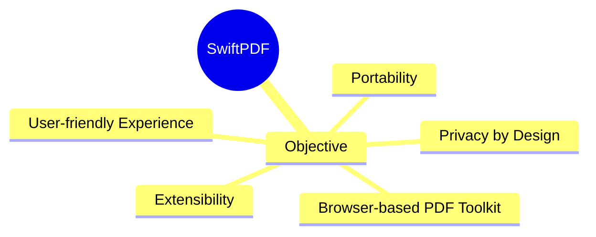
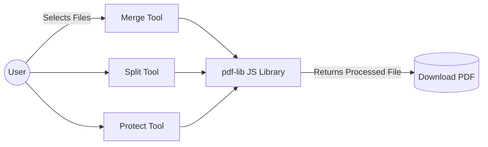
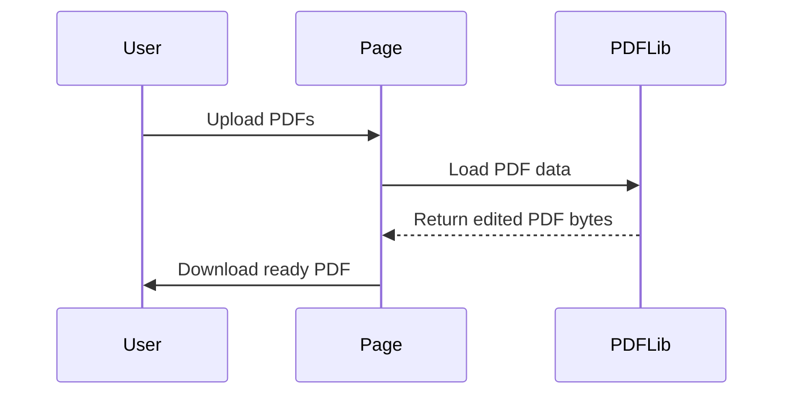
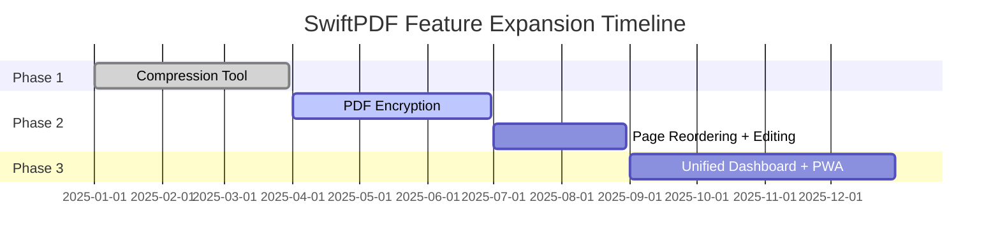
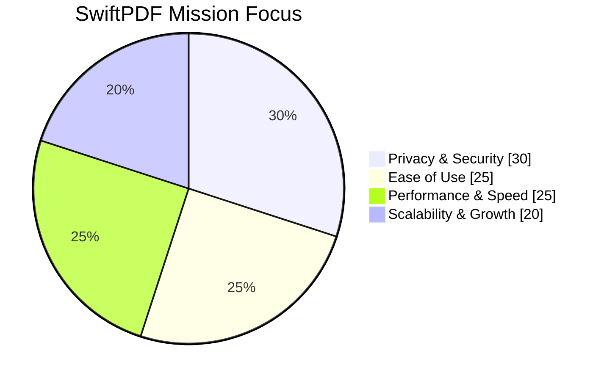

## **SwiftPDF — Visual Synopsis and Professional Summary**

### **1. Overview Diagram — Core Objective**



**Summary:** SwiftPDF is a zero-setup, browser-based PDF editing and conversion tool emphasizing **speed**, **privacy**, and **simplicity**. It runs fully client-side, ensuring no data leaves the user’s device.

---

### **2. Technology Stack Visualization**

```mermaid
graph TD
  A[HTML5 + CSS3] -->|UI & Layout| SwiftPDF
  B[Bootstrap 5] -->|Grid + Components| SwiftPDF
  C[JavaScript (ES6)] -->|Logic + PDF Handling| SwiftPDF
  D[pdf-lib] -->|Client-side PDF Processing| SwiftPDF
  E[jQuery] -->|DOM Manipulation| SwiftPDF
  F[Typed.js] -->|Text Animations| SwiftPDF
  G[Google Fonts] -->|Typography| SwiftPDF
  H[Web3Forms] -->|Contact Form Backend| SwiftPDF
```

**Key Point:** Every library was chosen for **lightweight performance** and **ease of deployment**.

---

### **3. Tool Availability Chart**

| Feature | Status | Description |
|----------|---------|--------------|
| Merge PDFs | ✅ Available | Combine multiple files into one |
| Split PDFs | ✅ Available | Separate pages from a document |
| Protect PDFs | ✅ Available | Apply watermark for security |
| Compress PDFs | 🕓 Planned | Reduce file size (lossy/lossless) |
| Word → PDF | 🕓 Planned | Convert Word documents |
| PPT → PDF | 🕓 Planned | Convert presentations |
| Digital Signatures | 🕓 Planned | Add handwritten or PKI-based signatures |

---

### **4. Architecture — Client-Side Workflow**



**Explanation:** All PDF operations occur within the **browser**. The **pdf-lib** library handles PDF manipulation, while downloads are generated via **Blob URLs** — no backend server is involved.

---

### **5. Process Sequence (for any operation)**



---

### **6. Limitations (Visual Summary)**

| Constraint | Description |
|-------------|--------------|
| ⚠️ No True Encryption | Watermark only — no password-based lock |
| ⚠️ Memory Limits | Browser-based, limited for large PDFs |
| ⚠️ PDF-only Support | No DOCX/PPTX support yet |
| ⚠️ CDN Dependency | First use requires internet (for library load) |

---

### **7. Future Roadmap — Growth Vision**



**Planned Additions:**
- AES-256 PDF Encryption
- Compression presets
- Drag & drop page management
- Unified PDF workspace (all-in-one dashboard)
- PWA for offline access
- Multi-language & accessibility support

---

### **8. Overall System Vision — Flow Overview**

```mermaid
flowchart TB
  subgraph Frontend (Client)
    UI[HTML + Bootstrap] --> Logic[JavaScript]
    Logic --> PDFLib[pdf-lib Engine]
    PDFLib --> Output[Downloadable PDF]
  end
  subgraph External Services
    Contact[Web3Forms Service]
  end
  Logic --> Contact
```

---

### **9. Key Takeaways**

- ✅ **Privacy-first**: 100% client-side, no uploads.
- 🚀 **Fast performance**: In-memory PDF manipulation.
- 💎 **Premium UI/UX**: Elegant typography, gradients, smooth animations.
- 🌍 **Portable & Offline-ready**: Works on static hosting.
- 🧩 **Expandable architecture**: Designed for modular feature addition.

---

### **10. Summary Visualization — Mission Impact**



---

**Final Statement:**  
SwiftPDF redefines how PDFs can be managed — a **powerful, elegant, and secure web application** built to offer **desktop-level control** with **zero installation**. It reflects the perfect blend of **technical efficiency**, **user-centric design**, and **visionary scalability** for the modern digital ecosystem.


