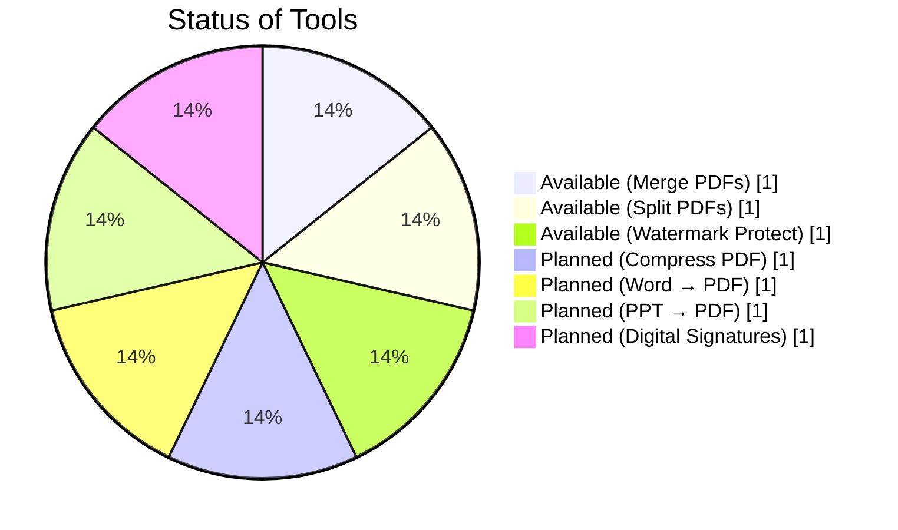
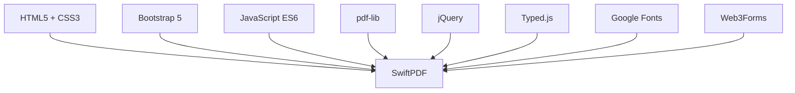
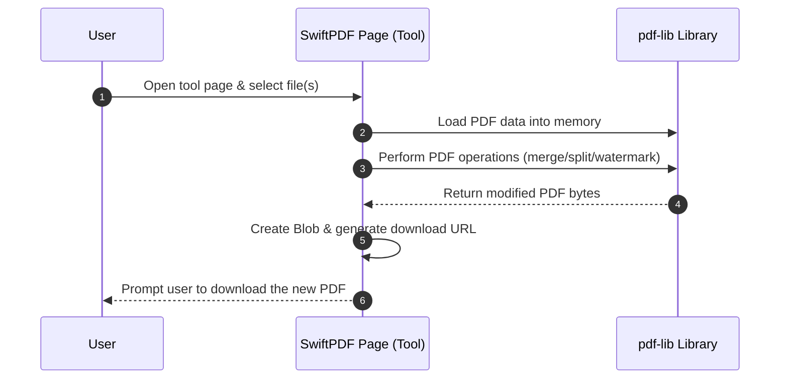
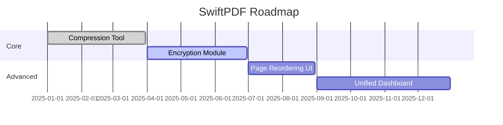

# SwiftPDF – Project Synopsis

> “Swiftly Handle PDFs with Ease and Zero Cost! Enjoy Seamless PDF Editing and Conversion Anytime, Anywhere.”  
> **– SwiftPDF Mission Statement[1]**

---

## Objective

- **Browser-Based PDF Toolkit:** Provide zero-setup PDF utilities that run fully in the browser, eliminating the need for installing any software[2].  
- **Privacy by Design:** Ensure user documents never leave the local machine – all PDF processing is done client-side for maximum data security[3].  
- **User-Friendly Experience:** Deliver a simple, fast, and accessible interface suitable for all users, with a polished and responsive design. This allows even non-technical users to handle PDFs effortlessly[4][5].  
- **Portability:** Enable easy deployment anywhere – the app can run on a static web host, CDN, or even directly from local files, making it highly portable and offline-capable (with cached assets)[6][7].  
- **Extensibility:** Establish a clear roadmap to incorporate advanced document workflows over time, ensuring the project can grow with new features like compression, encryption, and more[8][9].  

---

## Introduction

SwiftPDF is a web application for seamless PDF editing and conversion. It aims to be an all-in-one solution for common PDF tasks – such as merging multiple PDFs into one, splitting a PDF into separate pages, and applying watermarks for protection – all directly within a web browser[10].  
By operating entirely on the client side, SwiftPDF ensures fast performance and strong privacy, since files are processed in-memory and never uploaded to any server[11][12]. Users can simply open the app (or even a local copy of it) and start working with their PDFs instantly, reflecting the project’s “zero setup” philosophy[2].  
The interface has been crafted with a clean, modern aesthetic – leveraging Bootstrap 5 and custom CSS for a responsive layout, along with elegant Google Fonts and SVG illustrations – to give a premium look and smooth user experience[13][14].

---

### Key Features

As of now, SwiftPDF offers three primary tools: **Merge PDFs**, **Split PDF pages**, and **Protect PDF (watermark)**[10].  
These cover the essential use-cases for day-to-day document handling.

What makes SwiftPDF stand out:
- Entirely client-side for maximum privacy
- No installation (just open and go)
- Instant feedback with previews and downloads
- Polished UI with smooth animations

This focus on **convenience and elegance** positions SwiftPDF as a “number one web app for editing PDFs with ease”, keeping “your data safe and secure”[15].

---

### Project Status

The chart below gives an overview of SwiftPDF’s tools – available and planned:



> *(Figure: SwiftPDF Toolset – 3 features available, 4 planned)*

---

## Technologies Used

- **HTML5 & CSS3:** Structure & responsive layouts[17][18]  
- **JavaScript (Vanilla ES6):** Handles client-side logic and PDF operations[19]  
- **pdf-lib:** Core in-browser PDF processing engine[20]  
- **jQuery:** For quick DOM manipulations[21]  
- **Typed.js:** Typewriter animation for banners[22]  
- **Google Fonts:** Iceland, Montserrat Alternates, Caveat, Indie Flower, Alegreya[23]  
- **Web3Forms Service:** Handles contact form submissions[24]  



---

## Architecture & Workflow

SwiftPDF follows a **fully static, client-side architecture**.

```mermaid
flowchart LR
    subgraph Client Browser
      I[index.html]:::page["Landing Page"]
      M[merge.html]:::page["Merge Tool"]
      S[split.html]:::page["Split Tool"]
      P[protect.html]:::page["Watermark Tool"]
      C[contact.html]:::page["Contact Form"]
    end
    U((User)) -->|Select PDFs| M
    U -->|Open App| I
    I --> M & I --> S & I --> P & I --> C
    M ..> L[pdf-lib Library]:::ext
    S ..> L[pdf-lib Library]:::ext
    P ..> L[pdf-lib Library]:::ext
    M -->|Blob URL| D[(Download)]
    S -->|Blob URL| D[(Download)]
    P -->|Blob URL| D[(Download)]
    classDef page fill:#f0f9ff,stroke:#b4dce7,stroke-width:1px;
    classDef ext fill:#ffd,stroke:#dda,stroke-width:1px,font-style:italic;
```

---

### Sequence Flow



---

## Limitations

| Limitation | Description |
|-------------|--------------|
| ❌ No True Encryption | Watermark only – no password protection[29][33] |
| ⚠️ Memory Constraints | Large PDFs may fail on low-memory devices[12] |
| 🔒 Limited File Support | Only PDFs supported (Word/PPT coming soon)[16] |
| 🧩 Placeholder Features | Compress, Sign, Convert are under development[16] |
| 🌐 Initial Load | Requires CDN assets for first-time use[34][25] |

---

## Conclusion

SwiftPDF delivers a **fast, private, and elegant** solution for common PDF tasks — merge, split, and watermark — all directly in the browser.  
It offers **confidentiality, portability, and extensibility**, providing a foundation for an advanced, open, and community-driven PDF suite[35][36].

---

## Future Scope

- **Secure PDF Encryption (AES-128/256)**[37]  
- **PDF Compression (lossy/lossless)**[38]  
- **Page Reordering & Editing Tools**[39]  
- **Unified Workspace Dashboard**[40]  
- **Digital Signatures (Draw/PKI)**[41]  
- **Format Conversions (DOCX, PPTX, Image ↔ PDF)**[42][43]  
- **Offline PWA Support**[44]  
- **i18n & Accessibility Features**[45]  



---

## References

- SwiftPDF GitHub Repository – [Khushal Sehrawat (2025)](https://github.com/khushalsehrawat/swiftpdf) [2][35]  
- SwiftPDF Official Website – [swiftpdf.vercel.app](https://swiftpdf.vercel.app) [1][15][47]  
- pdf-lib Library – [Hopding / pdf-lib.js](https://github.com/Hopding/pdf-lib) [48]  
- Bootstrap 5 – [GetBootstrap.com](https://getbootstrap.com) [49]  
- Typed.js – [Matt Boldt](https://mattboldt.com/demos/typed-js/) [50]  
- Web3Forms – [web3forms.com](https://web3forms.com) [51]

---
